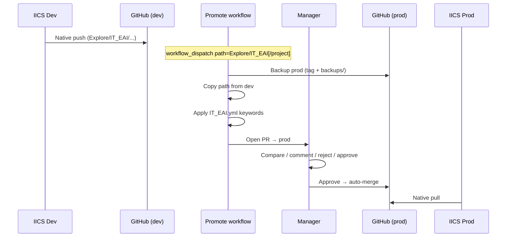

# INFORMATICA_INTEGRATIONS — IICS ↔ GitHub promotion

Single repository for all IICS projects under `Explore/`, with Dev→Prod promotion, folder-scoped keyword replacement, manager approval, and production backup/rollback.

## Environments

| IICS org | Git branch | Direction |
|----------|------------|-----------|
| **Dev**  | `dev`      | Native IICS push/pull |
| **Prod** | `prod`     | Native IICS pull after approved promote |

Two branches are required so Dev and Prod can hold different keyword values while sharing one repo and one folder tree. Projects do **not** get their own repos or long-lived branches.

## Repository layout

```text
INFORMATICA_INTEGRATIONS/
├── Explore/
│   └── IT_EAI/              # top-level folder = keyword-map scope
│       ├── WD_Coupa/        # project (and more projects under IT_EAI)
│       └── ...
├── config/keyword-maps/
│   └── IT_EAI.yml           # applies to ALL projects under Explore/IT_EAI/
├── backups/                 # timestamped copies taken before each promote
├── scripts/
│   ├── replace_keywords.py
│   ├── backup_prod.sh
│   └── rollback_prod.sh
└── .github/workflows/
    ├── promote-dev-to-prod.yml
    └── promote-auto-merge.yml
```

Keyword maps are keyed by the **first folder under `Explore/`**:

- `Explore/IT_EAI/**` → `config/keyword-maps/IT_EAI.yml`
- `Explore/FINANCE/**` → `config/keyword-maps/FINANCE.yml` (add when needed)

All projects under that folder share the same replacements.

## End-to-end flow



1. Develop and check in from **IICS Dev** (native Git map → `dev`).
2. Run **Actions → Promote Dev to Prod** with path `Explore/IT_EAI` or `Explore/IT_EAI/WD_Coupa`.
3. Workflow backs up current `prod`, copies from `dev`, applies keywords from the matching map file.
4. Manager reviews the PR (Files changed = functional + Dev→Prod keyword diffs), then rejects, comments, or **approves**.
5. On approval, **auto-merge** merges into `prod` (if enabled — see switch below).
6. **IICS Prod** pulls from `prod` via native Git integration.

## Auto-merge switch

In `config/promotion.yml`:

```yaml
auto_merge_to_prod: true   # set false to require manual merge after approval
```

| Value | Behavior after manager approves |
|-------|----------------------------------|
| `true` | PR merges to `prod` automatically |
| `false` | Approval only; merge the PR manually when ready |

## Keyword file example

Edit `config/keyword-maps/IT_EAI.yml`:

```yaml
scope: Explore/IT_EAI
replacements:
  - find: "_DEV_"
    replace: "_PROD_"
  - find: "IICS_DEV_CONN"
    replace: "IICS_PROD_CONN"
```

Local dry-run:

```bash
pip install -r scripts/requirements.txt
python scripts/replace_keywords.py --path Explore/IT_EAI --dry-run
```

## Backup and rollback

Before each promote, the workflow backs up **only the path being promoted** (not the whole `prod` branch).

| Promote path | Backup contents |
|--------------|-----------------|
| `Explore/IT_EAI/WD_Coupa` | Only `WD_Coupa` |
| `Explore/IT_EAI` | Entire `IT_EAI` folder |

Stored under `backups/<timestamp>-Explore-.../`.

Rollback after a bad Prod pull (restores that path only):

```bash
scripts/rollback_prod.sh backups/20260806T120000Z-Explore-IT_EAI-WD_Coupa
git push origin prod
```

Then pull again in IICS Prod.

## GitHub setup checklist

1. Create repo **INFORMATICA_INTEGRATIONS**; push this content.
2. Create branches `dev` and `prod` (protect `prod`).
3. On **prod**: require PR reviews, require Code Owners, block force-push (except controlled rollback).
4. Confirm `.github/CODEOWNERS` managers (`sailesh.kumaryadav@anaplan.com`, `bijesh.balakrishnan@anaplan.com`) match their GitHub accounts.
5. In IICS:
   - Dev org → GitHub repo `INFORMATICA_INTEGRATIONS`, branch `dev`
   - Prod org → same repo, branch `prod`
6. Optionally allow GitHub Actions to create PRs / auto-merge (repo Settings → Actions / merge queue as needed).

## Adding another portfolio folder

1. Create `Explore/<FOLDER>/` (IICS push will populate projects).
2. Add `config/keyword-maps/<FOLDER>.yml` with that folder’s Dev→Prod tokens.
3. Add Code Owners for `Explore/<FOLDER>/**` if a different manager group owns it.
4. Promote with path `Explore/<FOLDER>` or `Explore/<FOLDER>/<project>`.
